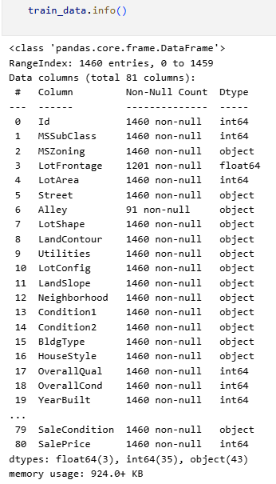

# House Prices Prediction - Advanced Regression Techniques
### Project Overview:
This Project is about predicting house prices using ML Models, The dataset used is Ames Housing dataset. I am not specifying details about dataset, goals, overview in this repo but you can find those details here: [Kaggle Houses prices Competition](https://www.kaggle.com/competitions/house-prices-advanced-regression-techniques)

### How to Replicate
1. Clone the repository: `git clone <repo-link>`
2. Install dependencies
3. Run the main notebook/script

### Overview of My Approach
Lets take a glance at train_data.info() before we proceed into the feature engineering steps.

### Feature Engineering for House Price Prediction
This document outlines the feature engineering process applied to the dataset to prepare it for modeling.
#### Exploring Data Analysis (EDA):
The initial analysis focused on the target variable, SalePrice. A visual inspection revealed a positive skew. Applying a log transformation to SalePrice normalized its distribution, making it more suitable for linear models.

![train_data['SalePrice']](Images/image01.png)

After log Transformation

![log(train_data['SalePrice'])](Images/image02.png)
#### Handling Missing Values:
Missing data was addressed using several strategies based on the nature of the feature:

- Dropped Column: The Utilities column was removed due to a high number of missing values and low variance.

- Imputing 'None': For categorical features where NaN indicated the absence of a feature (e.g., PoolQC, Alley, Fence), NaN was replaced with the string 'None'.

- Imputing Zero: For numerical features where NaN logically meant zero (e.g., GarageArea, TotalBsmtSF), NaN was replaced with 0.

- Median Imputation: Missing LotFrontage values were imputed with the median LotFrontage of their respective Neighborhood.

- Mode Imputation: For categorical features with a small number of missing values likely due to data entry errors (e.g., MSZoning, Electrical), NaN was replaced with the feature's mode.
#### Transforming Skewed Features
Numerical features with a skewness greater than 0.75 were identified. A log transformation (np.log1p) was applied to these features to reduce their skew and help models that assume a normal distribution.

#### Feature Type Conversion
Certain numerical features that are inherently categorical were converted to string types to ensure they are treated as discrete categories during one-hot encoding. This included MSSubClass, OverallCond, YrSold, and MoSold.

#### Creating New Features
To capture more complex relationships, new features were engineered from existing ones:

- TotalSF: The sum of TotalBsmtSF, 1stFlrSF, and 2ndFlrSF to create a total living area feature.

- Total_Bathrooms: A weighted sum of all bathroom types (FullBath, HalfBath, BsmtFullBath, BsmtHalfBath).

#### Encoding Categorical Features
All categorical features were converted into a numerical format using one-hot encoding (pd.get_dummies). The drop_first=True argument was used to avoid multicollinearity by dropping the first category of each feature.

### Models

* Linear Models: Linear Regression, Stochastic Gradient Descent (SGD)

* Support Vector Machines: Support Vector Regressor (SVR)

* Tree-Based Models: Decision Tree Regressor
* Bagging Regressor
* Pasting Regressor
* Support Vector Regressor
* Mini Batch Regressor
* Gradient Boosting Regressor 
* Random Forest Regressor 
* XGBoost Regressor 
* LightGBM Regressor
* CatBoost Regressor 
* Voting Regressor4- lr,gbr, sgb, svr
* Voting Regrssor3= xbg,cat,lgbm
* Stacking Regressor

Hyperparameter tuning using Grid Search was performed on several key models to optimize their performance.
### Results 

This is the leaderboard with model & its respective RMSE & R^2 Score for evaluation.

| Model                               | RMSE | R^2 Score |
| ----------------------------------- | ------------------- | --------- |
| VotingRegressor4                    | 0.125546            | 0.915538  |
| VotingRegressor                     | 0.126424            | 0.914352  |
| VotingRegressor3                    | 0.130580            | 0.908628  |
| XGBRegressorTuned                   | 0.130896            | 0.908186  |
| CatBoostRegressor                   | 0.131131            | 0.907855  |
| CatBoostRegressorTuned              | 0.131131            | 0.907855  |
| LGBMRegressorTuned                  | 0.136270            | 0.900492  |
| XGBRegressor                        | 0.136405            | 0.900295  |
| GradientBoostingRegressor           | 0.136625            | 0.899973  |
| LinearRegression                    | 0.138482            | 0.897235  |
| SVR with Tuning                     | 0.138924            | 0.896578  |
| GradientBoostingRegressor with Tuning | 0.139298            | 0.896021  |
| LGBMRegressor                       | 0.146495            | 0.884999  |
| RandomForestRegressor with Tuning   | 0.148706            | 0.881502  |
| BaggingRegressor                    | 0.151856            | 0.876428  |
| SVR                                 | 0.155795            | 0.869935  |
| DecisionTreeRegressorTuned          | 0.197506            | 0.790967  |
| PastingRegressor                    | 0.209188            | 0.765507  |
| DecisionTreeRegressor               | 0.232955            | 0.709194  |
| MiniBatchRegressor                  | 0.264070            | 0.626325  |
| SGDRegressor                        | 0.292821            | 0.540526  |

### Evaluation Metrics
To measure model performance, two key regression metrics were used: Root Mean Squared Error (RMSE) and R-Squared (R²). Since the target variable SalePrice was log-transformed to normalize its distribution, the metrics are calculated on these log values.

A lower RMSE value indicates a better-fitting model.

A higher R² value indicates a better-fitting model.
### Conclusion & Performance Analysis
The best-performing model was VotingRegressor4, an ensemble of Linear Regression, Gradient Boosting, Stochastic Gradient Boosting, and Support Vector Regression.

It achieved the top score of 0.126 on the leaderboard, indicating the strongest predictive performance among all tested models.
